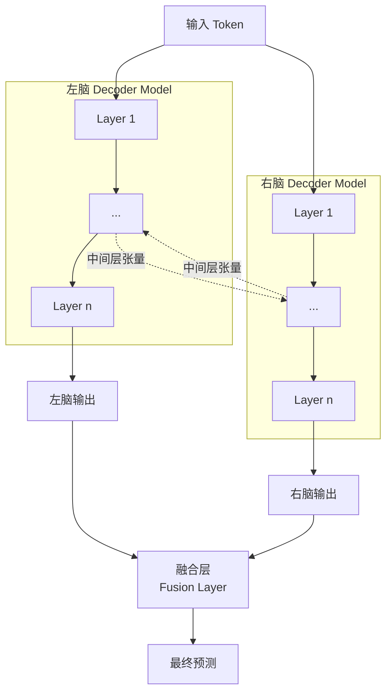

# Two Brain llm

模仿左右脑结构，训练时候有两个完整的decoder-only的模型
使用中间层张量传输来通信，最后用其中一个来作为最终输出

## 架构示意图

## 评价

### 优点
- 多路径推理，模型可学到互补特征
- 冗余机制提高稳定性
- 中间层互动允许"协商"

### 核心问题
- **计算成本翻倍** — 同样成本下不如训练更大的单一模型
- **收敛稳定性** — 两个模型梯度相互影响
- ~~**输出设计过简**~~ **→ 改为融合层** — 用可学习的融合机制组合两个输出

### 改进方案
用轻量级融合层代替简单选择：
- 学习加权组合（learned weights）
- 或使用 attention 机制决定融合比例
- 这样两个"脑"的输出都能对最终决策有贡献

